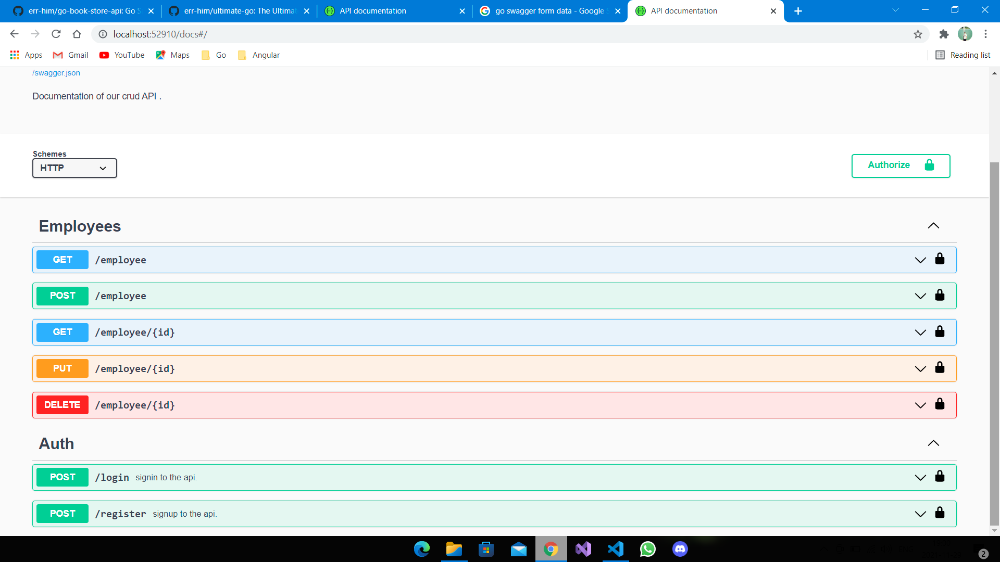

# GO REST API WITH MYSQL

## Description

Simple RESTFull API for learning purposes, using Golang and MySql as Database with MVC  

## Resources

[Github repo to build RESTFull APIs with go](https://github.com/err-him/go-book-store-api)  
[Medium article about go-swagger](https://medium.com/@pedram.esmaeeli/generate-swagger-specification-from-go-source-code-648615f7b9d9)

## Dependecies

- Gorilla MUX v1.8.0 [github.com/gorilla/mux](https://github.com/gorilla/mux)
- MySql Driver v1.6.0 [github.com/go-sql-driver/mysql](https://github.com/go-sql-driver/mysql)
- Viper v1.9.0 [github.com/spf13/viper](https://github.com/spf13/viper)
- Jwt Go v3.2.2 [github.com/golang-jwt/jwt](https://github.com/golang-jwt/jwt)
- Go crypro [golang.org/x/crypto](https://golang.org/x/crypto)

## Swagger

### Screenshots

